# HR Interviewer Agent 🤖

An AI-powered mock interview agent designed to conduct realistic technical and behavioral interviews, score candidate responses, and provide actionable feedback.

## 🌟 Features

-   **Role-Specific Interviews**: Supports Backend Engineer, Frontend Engineer, Data Scientist, and HR Generalist roles.
-   **Hybrid AI Engine**:
    -   **Gemini 1.5 Flash**: Generates dynamic questions and evaluates answers with a strict rubric.
    -   **Offline Fallback**: Robust local question bank ensures the interview never gets stuck, even without API access.
-   **Real-Time Scoring**: Provides immediate feedback, scores (0-10), and pass/fail verdicts.
-   **Voice & Text Support**: Candidates can speak their answers (transcribed via Speech-to-Text) or type them.
-   **Comprehensive Reporting**: Generates a detailed "True Report" with executive summary, strengths, and hiring recommendation.
-   **Robust Architecture**: Auto-recovery from API failures and "stuck" states.

## 🏗️ System Architecture

```mermaid
graph LR
    User((👤 Candidate)) --> UI[💻 Web Interface]
    UI <--> App{⚙️ Core Logic}
    
    subgraph "Hybrid Intelligence"
        App <-->|Primary| Gemini[🧠 Gemini 1.5 Flash]
        App <-->|Context| RAG[📚 Local Knowledge Base]
        App <-->|Fallback| Offline[�️ Offline Mode]
    end
    
    style User fill:#f9f,stroke:#333,stroke-width:2px
    style UI fill:#fff3e0,stroke:#ef6c00
    style App fill:#e1f5fe,stroke:#01579b
    style Gemini fill:#e8f5e9,stroke:#2e7d32
    style RAG fill:#f3e5f5,stroke:#7b1fa2
    style Offline fill:#ffebee,stroke:#c62828
```



## 🛠️ Tech Stack

-   **Frontend**: Streamlit
-   **AI Models**: Google Gemini 1.5 Flash (via `google-genai` SDK)
-   **Vector Store**: Local JSON-based vector store for RAG (Retrieval Augmented Generation)
-   **Speech**: Browser-based TTS and STT

## 🚀 Getting Started

1.  **Clone the repository**:
    ```bash
    git clone <your-repo-url>
    cd hr-interviewer-agent
    ```

2.  **Install dependencies**:
    ```bash
    pip install -r requirements.txt
    ```

3.  **Set up Environment Variables**:
    Create a `.env` file in the root directory:
    ```env
    GOOGLE_API_KEY=your_gemini_api_key
    ```

4.  **Run the Application**:
    ```bash
    streamlit run app.py
    ```

## 🛡️ Robustness

This agent is built to be crash-proof:
-   **Multi-Model Fallback**: Retries with different Gemini models if one fails.
-   **Offline Mode**: Automatically switches to local questions if the internet or API is down.
-   **Auto-Recovery**: Detects and fixes "stuck" interview flows instantly.

## 📝 License

MIT
