# HR Interviewer Agent 🤖

An AI-powered mock interview agent designed to conduct realistic technical and behavioral interviews, score candidate responses, and provide actionable feedback.

## 🌟 Features

-   **Role-Specific Interviews**: Supports Backend Engineer, Frontend Engineer, Data Scientist, and HR Generalist roles.
-   **Hybrid AI Engine**:
    -   **Gemini 1.5 Flash**: Generates dynamic questions and evaluates answers with a strict rubric.
    -   **Offline Fallback**: Robust local question bank ensures the interview never gets stuck, even without API access.
-   **Real-Time Scoring**: Provides immediate feedback, scores (0-10), and pass/fail verdicts.
-   **Voice & Text Support**: Candidates can speak their answers (transcribed via Speech-to-Text) or type them.
-   **Vector Store**: Local JSON-based vector store for RAG (Retrieval Augmented Generation)
-   **Speech**: Browser-based TTS and STT


## 🏗️ System Architecture

```mermaid
graph LR
    %% Nodes
    User((👤 Candidate))
    UI[💻 Streamlit App]
    Brain{🧠 Orchestrator}
    
    subgraph "Hybrid Intelligence Engine"
        direction TB
        Gemini[☁️ Gemini 1.5 Flash]
        Embed[📐 OpenAI Embeddings]
        FAISS[📚 FAISS Vector Store]
        Serp[🌐 SerpAPI Search]
        Offline[🛡️ Offline Heuristics]
    end
    
    Report[📄 True Report]

    %% Flow
    User ==> UI
    UI ==> Brain
    
    Brain <==>|Reasoning| Gemini
    Brain <-->|Semantic Check| Embed
    Brain <-->|Retrieval| FAISS
    Brain <-->|Fact Check| Serp
    Brain -.->|Fallback| Offline
    
    Brain ==> Report
    Report ==> UI

    %% Styling
    classDef dark fill:#000,stroke:#fff,stroke-width:2px,color:#fff;
    classDef blue fill:#0d47a1,stroke:#fff,stroke-width:2px,color:#fff;
    classDef white fill:#fff,stroke:#000,stroke-width:2px,color:#000;

    class User,UI,Report white;
    class Brain dark;
    class Gemini,Embed,FAISS,Serp,Offline blue;
    
    linkStyle default stroke:#333,stroke-width:2px;
```



## 🚀 Getting Started

1.  **Clone the repository**:
    ```bash
    git clone <your-repo-url>
    cd hr-interviewer-agent
    ```

2.  **Install dependencies**:
    ```bash
    pip install -r requirements.txt
    ```

3.  **Set up Environment Variables**:
    Create a `.env` file in the root directory:
    ```env
    GOOGLE_API_KEY=your_gemini_api_key
    ```

4.  **Run the Application**:
    ```bash
    streamlit run app.py
    ```

## 🛡️ Robustness

This agent is built to be crash-proof:
-   **Multi-Model Fallback**: Retries with different Gemini models if one fails.
-   **Offline Mode**: Automatically switches to local questions if the internet or API is down.
-   **Auto-Recovery**: Detects and fixes "stuck" interview flows instantly.

## 📝 License

MIT
